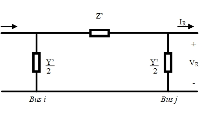
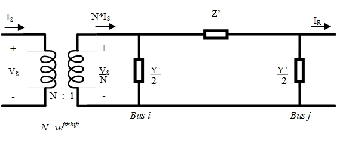

# Branch Model

Transmission lines and different types of transformers (traditional, Load Tap-Changing transformers (LTC) and Phase Angle Regulators (PARs)) can be modeled with a common branch model. 

## Transmission Line Model

The most common circuit that is used to represent the transmission line model is $`\pi`$ circuit as shown in Figure 1. The nominal flow direction is from sending bus _s_ to receiving bus _r_.

<div align="center">
   
   
   
  Figure 1: Transmission line $`\pi`$ equivalent circuit
</div>

Here
``` math
Z'=R+jX
```
and
``` math
Y'=G+jB,
```
where $`R`$ is line series resistance, $`X`$ is line series reactance, $`B`$ is line shunt charging, and $`G`$ is line shunt conductance. As can be seen from Figure 1 total $`B`$ and $`G`$ are separated between two buses.
The current leaving the sending bus can be obtained from Kirchhoff's current law as
```math
I_s = y(V_s - V_r) + \frac{Y'}{2} V_s,
```
where $`V_s`$ and $`V_r`$ are voltages on sending and receiving bus, respectively, and
```math
y = \frac{1}{Z'} = \frac{R}{R^2+X^2} + j\frac{-X}{R^2+X^2} = g + jb.
```
Similarly, current leaving receiving bus is given as
```math
-I_R = y(V_r - V_s) + \frac{Y'}{2} V_r.
```
These equations can be written in a compact form as:
```math
\begin{bmatrix}
I_{s}\\
-I_{r}
\end{bmatrix}
= \mathbf{Y}_{TL}
\begin{bmatrix}
V_{s}\\
V_{r}
\end{bmatrix}
```
where:
```math
\mathbf{Y}_{TL}=\begin{bmatrix}
  g + jb + \dfrac{G+jB}{2} & -(g + jb) \\
-(g + jb)                  &   g + jb + \dfrac{G+jB}{2}
\end{bmatrix}
```

### Branch contributions to residuals for sending and receiving bus

Complex power leaving sending and receiving bus is computed as
```math
\begin{bmatrix}
S_{s}\\
S_{r}
\end{bmatrix}
=
\begin{bmatrix}
V_{s}\\
V_{r}
\end{bmatrix}
\begin{bmatrix}
I_{s}\\
-I_{r}
\end{bmatrix}^*
=
\begin{bmatrix}
V_{s}\\
V_{r}
\end{bmatrix}
\mathbf{Y}_{TL}^*
\begin{bmatrix}
V_{s}\\
V_{r}
\end{bmatrix}^*
```
After some algebra, one obtains expressions for active and reactive power that the branch takes from adjacent buses:
```math
P_{s} =  \left(g + \frac{G}{2}\right) |V_{s}|^2 + [-g \cos(\theta_s - \theta_r) - b \sin(\theta_s - \theta_r)] |V_{s}| |V_{r}|
```

```math
Q_{s} = -\left(b + \frac{B}{2}\right) |V_{s}|^2 + [-g \sin(\theta_s - \theta_r) + b \cos(\theta_s - \theta_r)] |V_{s}| |V_{r}|
```

```math
P_{r} =  \left(g + \frac{G}{2}\right) |V_{r}|^2 + [-g \cos(\theta_s - \theta_r) + b \sin(\theta_s - \theta_r)] |V_{s}| |V_{r}|
```

```math
Q_{r} = -\left(b + \frac{B}{2}\right) |V_{r}|^2 + [ g \sin(\theta_s - \theta_r) + b \cos(\theta_s - \theta_r)] |V_{s}| |V_{r}|
```

These quantities are treated as _loads_ and are substracted from $`P`$ and $`Q`$ residuals computed on the respective buses.

## Branch Model

**Note: Transformer model not yet implemented**

The branch model can be created by adding the ideal transformer in series with the $`\pi`$ circuit as shown in Figure 2 where $`\tau`$ is a tap ratio magnitude and $`\theta_{shift}`$is the phase shift angle.

<div align="center">
   
   
   
  Figure 2: Branch equivalent circuit
</div>


The branch admitance matrix is then:

```math
\mathbf{Y}_{BR}=
\begin{bmatrix}
 \left(g + jb + \dfrac{G+jB}{2} \right)\dfrac{1}{\tau^2} & -(g + jb)\dfrac{1}{\tau e^{-j\theta_{shift}}}\\
 &\\
     -(g + jb)\dfrac{1}{\tau e^{j\theta_{shift}}}.       &   g + jb + \dfrac{G+jB}{2}
\end{bmatrix}
```
### Branch contribution to residuals for sending and receiving bus

The power flow contribution for the transformer model are obtained in a similar manner as for the $`\pi`$-model.
