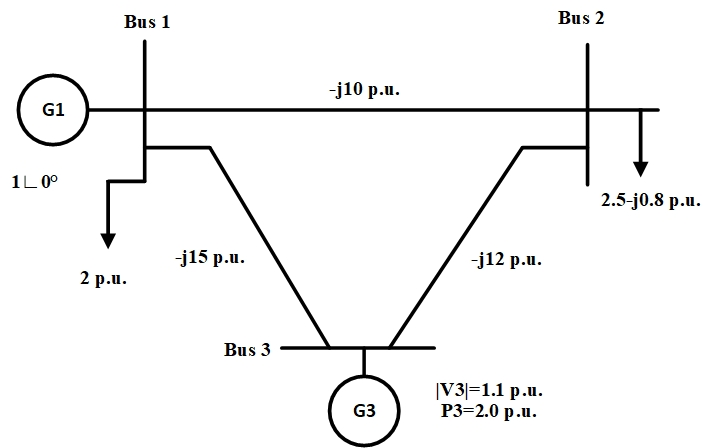

# Power Flow Example for 3-bus Grid

This example provides power flow analysis for a simple 3-bus grid model. The example runs power flow for a monolithic 3-bus model and a model assembled from components.

The power flow is the analysis of the flow of electric power, voltages, and currents in normal steady-state operation. It calculates the voltage magnitude and phase angle of each bus from which real and reactive flow on all lines as well as the associated equipment losses can be computed.
The mathematical model of the power flow problem is formulated as a set of nonlinear equations. Due to the nonlinear nature of the problem formulation, power flow typically requires numerical solution. The model needs to provide residual vector and (typically) Jacobian matrix to the numerical nonlinear solver.

## Model Equations

The model and its parameters are described in Figure 1:

<div align="center">
   
   
   
  Figure 1: A simple 3-bus grid example.
</div>

Problem variables are voltage magnitudes and phases; they are stored in bus objects. Branch and load models do not have any internal variables. Contributions to residual vector for the model are computed in individual component model objects. Residual values are sumed up and stored in buses.  

### Residual

**Bus 1**: Slack bus, does not store variables no residuals. Voltage and phase are set to $`V_1 \equiv 1`$p.u. and $`\theta_1 \equiv 0`$, respectively.

**Bus 2**: PQ bus, stores variables $`V_2, \theta_2`$ and residuals $`P_2, Q_2`$. Load $`P_{L2} = 2.5`$p.u., $`Q_{L2} = -j0.8`$p.u. is attached to it. From the equations for [branch](../../ComponentLib/Branch/README.md) and [load](../../ComponentLib/Load/README.md) components, we assemble Bus 2 residuals as:
```math
\begin{array}{rcll}
P_2 & = &-P_{L2} &~~~\mathrm{(load ~2)} \\
      &&+ b_{12}|V_1||V_2|\sin(\theta_2-\theta_1) &~~~\mathrm{(branch ~12)} \\
      &&+ b_{23}|V_2||V_3|\sin(\theta_2-\theta_3) &~~~\mathrm{(branch ~23)} \\
Q_2 & = & -Q_{L2} &~~~\mathrm{(load ~2)} \\
      &&+ b_{12}|V_2|^2 - b_{12}|V_1||V_2|\cos(\theta_2-\theta_1) &~~~\mathrm{(branch ~12)} \\
      &&+ b_{23}|V_2|^2 - b_{23}|V_2||V_3|\cos(\theta_2-\theta_3) &~~~\mathrm{(branch ~23)}
\end{array}
``` 

**Bus 3**: PV bus, stores variable $`\theta_3`$ and residual $`P_3`$. Voltage is set to $`|V_3| \equiv 1.1`$p.u.. Generator $`P_{G3} = 2`$p.u. is attached to it. From the equations for [branch](../../ComponentLib/Branch/README.md) and [generator](../../ComponentLib/Gen/README.md) components, we assemble Bus 3 residual as:
```math
\begin{array}{rcll}
P_3 & = &P_{G3} &~~~\mathrm{(generator ~3)} \\
      &&+ b_{13}|V_1||V_3|\sin(\theta_3-\theta_1) &~~~\mathrm{(branch ~13)} \\
      &&+ b_{23}|V_2||V_3|\sin(\theta_3-\theta_2) &~~~\mathrm{(branch ~23)} \\
\end{array}
```

By substituting $`b_{12}=-10`$p.u., $`b_{13}=-15`$p.u., and $`b_{23}=12`$p.u., we obtain residuals
```math
\begin{aligned}
P_{2} &= -2.5 - 10|V_2|\sin(\theta_2) - 13.2|V_2|\sin(\theta_2 - \theta_3), \\
Q_{2} &=  0.8 - 22|V_2|^2 + 10|V_2|\cos(\theta_2) + 13.2|V_2|\cos(\theta_2 - \theta_3), \\
P_{3} &= -2   - 16.5\sin(\theta_3) + 13.2|V_2|\sin(\theta_2 - \theta_3),
\end{aligned}
```
with variables $`\theta_2, |V_2|`$ and $`\theta_3`$.

### Jacobian

Nonlinear solver can approximate Jacobian numerically, however this is computationaly expensive and scales poorly with the size of the problem. Typically, one needs to provide Jacobian in addition to residual to the nonlinear solver. For nonlinear problem defined by (vector) function $`\mathbf{f}(\mathbf{x})=0`$, Jacobian matrix is defined as
```math
J_{i,j}=\frac{\partial f_i}{\partial x_j}, ~~~ i,j=1,\ldots,N
```
where $`N`$ is the size of vectors $`\mathbf{f}`$ and $`\mathbf{x}`$. Jacobian for our model is evaluated as
```math
\mathbf{J} = 
\begin{bmatrix}
\dfrac{\partial P_{2}}{\partial \theta_{2}} & 
\dfrac{\partial P_{2}}{\partial | V_{2} |} &
\dfrac{\partial P_{2}}{\partial \theta_{3}} \\
&&\\
\dfrac{\partial Q_{2}}{\partial \theta_{2}} & 
\dfrac{\partial Q_{2}}{\partial | V_{2} |} &
\dfrac{\partial Q_{2}}{\partial \theta_{3}} \\
&&\\
\dfrac{\partial P_{3}}{\partial \theta_{2}} &
\dfrac{\partial P_{3}}{\partial | V_{2} |} &
\dfrac{\partial P_{3}}{\partial \theta_{3}} 
\end{bmatrix}
```
where partial derivatives are:

```math
\begin{aligned}
\dfrac{\partial P_{2}}{\partial \theta_{2}} &= -10|V_{2}| \cos(\theta_{2}) - 13.2|V_{2}| \cos(\theta_{2}-\theta_{3}) \\
\dfrac{\partial P_{2}}{\partial |V_{2}|}    &= -10 \sin(\theta_{2}) - 13.2 \sin(\theta_{2}-\theta_{3}) \\
\dfrac{\partial P_{2}}{\partial \theta_{3}} &=  13.2|V_{2}| \cos(\theta_{2}-\theta_{3}) \\
\end{aligned}
```
```math
\begin{aligned}
\dfrac{\partial Q_{2}}{\partial \theta_{2}} &= -10|V_{2}| \sin(\theta_{2}) - 13.2 |V_{2}| \sin(\theta_{2} - \theta_{3}) \\
\dfrac{\partial Q_{2}}{\partial |V_{2}|}    &= -44|V_{2}| + 10 \cos(\theta_{2}) + 13.2 \cos(\theta_{2} - \theta_{3}) \\
\dfrac{\partial Q_{2}}{\partial \theta_{3}} &=  13.2|V_{2}| \sin(\theta_{2} - \theta_{3}) \\
\end{aligned}
```
```math
\begin{aligned}
\dfrac{\partial P_{3}}{\partial \theta_{2}} &=  13.2|V_{2}| \cos(\theta_{2}-\theta_{3}) \\
\dfrac{\partial P_{3}}{\partial |V_{2}|}    &=  13.2 \sin(\theta_{2}-\theta_{3}) \\
\dfrac{\partial P_{3}}{\partial \theta_{3}} &= -16.5 \cos(\theta_{3}) - 13.2|V_{2}| \cos(\theta_{2}-\theta_{3}) \\
\end{aligned}
```

### Reference solution

The reference solution to the nonlinear problem is:
```math
\theta_{2} = -4.88\degree \\
|V_{2}|    =  1.10 \mathrm{p.u.} \\
\theta_{3} =  1.49\degree \\
```
